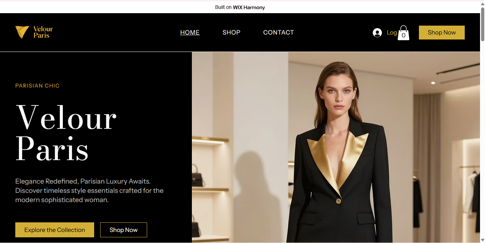
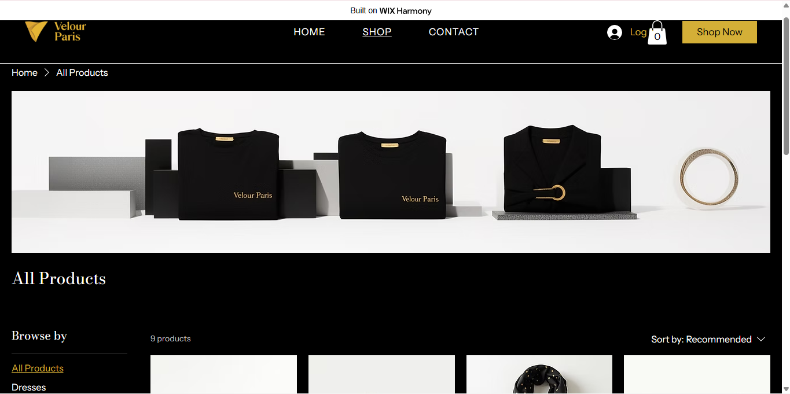

# Velour Paris 🖤✨
### *Luxury Fashion Boutique — Where Parisian Elegance Meets Modern Style*

---

## About This Project

This is an individual e-commerce project for the **E-Commerce and Web Application** course (EWA408510) at UNILAK. The goal was to design and deploy a fully functional online fashion boutique using a no-code platform.

**Student:** UMWALI Gloria  
**Registration Number:** 22604/2023  
**Lecturer:** Eric Maniraguha  
**Academic Year:** 2025–2026 | Semester II  
**Submission Date:** May 28, 2026  

---

## The Store

**Velour Paris** is a luxury fashion boutique offering curated clothing, accessories, and style essentials for the modern sophisticated woman. Every piece reflects timeless Parisian elegance and refined taste.

> *"Elegance Redefined. Parisian Luxury Awaits."*

---

## Platform

| Tool | Details |
|------|---------|
| **Platform** | Wix |
| **Type** | No-Code / AI-Assisted |
| **Store Feature** | Wix Stores (E-Commerce) |

Wix was chosen for its powerful AI site generator (Aria), drag-and-drop editor, and built-in store functionality — making it ideal for building a polished fashion boutique without writing code.

---

## Pages Built

| Page | Description |
|------|-------------|
| 🏠 Home | Hero banner, featured collection, brand tagline |
| 🛍️ Shop | Product catalog with images, prices and descriptions |
| 📖 About | Brand story and mission |
| 📞 Contact Us | Contact form, email, phone, address |
| 🛒 Cart | Add-to-cart and checkout simulation |

---

## Product Catalog

| Product | Price |
|---------|-------|
| Velour Silk Dress — Midnight Black | RWF 120,000 |
| Gold Clasp Handbag — Premium Leather | RWF 95,000 |
| Noir Blazer Set — Tailored Fit | RWF 145,000 |
| Pearl Drop Earrings — 18K Gold | RWF 45,000 |
| Satin Wrap Skirt — Ivory White | RWF 85,000 |
| Classic Silk Scarf | RWF 95 |
| Crossbody Envelope Bag | RWF 180 |
| Structured Shoulder Bag | RWF 220 |
| Geometric Clutch Bag | RWF 150 |

---

## Screenshots

**Homepage**



**Product Page**



**Contact Page**


---

## Live Links

🌐 **Live Site:** [https://gloriaumwali0.wixsite.com/velour-paris](https://gloriaumwali0.wixsite.com/velour-paris)  
📁 **GitHub Repo:** [https://github.com/umwaligloria/velour-paris](https://github.com/umwaligloria/velour-paris)

---

## Challenges I Faced

**1. Generating a consistent aesthetic**  
Getting Wix's AI to produce a true black-and-gold luxury look required several iterations and manual adjustments in the editor.

**2. Contact page setup**  
The AI-generated site didn't include a Contact page by default, so I had to add it manually using the Sections panel and AI generation.

**3. Product pricing**  
The auto-generated products used default pricing that didn't match the brand's luxury positioning, requiring manual updates.

---

## What I Learned

**No-code is powerful** — Building a fully functional e-commerce store in a few hours showed me that no-code tools can produce professional results quickly.

**Design thinking matters** — Every color, font and layout choice affects how a brand is perceived. Luxury brands need consistency above all.

**Documentation is a skill** — Writing this README taught me to communicate my process clearly, which is a key professional skill.

**GitHub beyond code** — I learned that GitHub is not just for developers — it's a powerful tool for documenting any kind of project.

---

## Repository Structure

```
velour-paris/
├── README.md
└── images/
    ├── homepage.png
    ├── products.png
    └── contact-cart.png
```

---

*UMWALI Gloria | UNILAK | EWA408510 | 2026*
